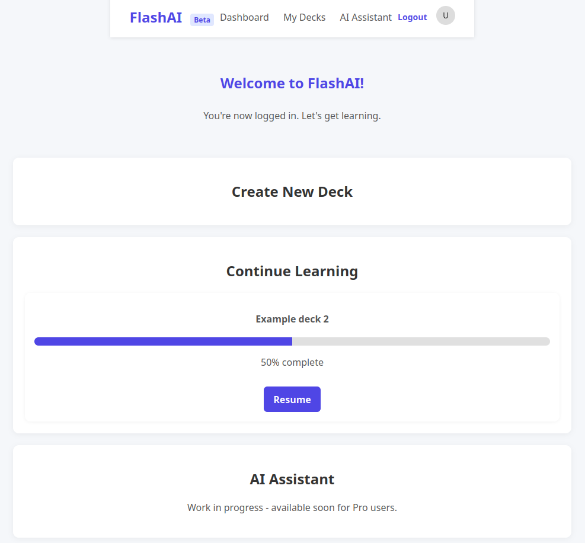

# FlashAI

Aplikacja do nauki z wykorzystaniem fiszek, przygotowana w ramach zajęć z WdPAI. Projekt korzysta z kontenerów Docker (Nginx, PHP oraz PostgreSQL) i pozwala na tworzenie talii, dodawanie fiszek oraz przeprowadzanie nauki w oparciu o prosty algorytm powtórek.

## Wymagania

- Docker i Docker Compose

## Uruchomienie

1. Sklonuj repozytorium.
2. W katalogu głównym uruchom:
   ```bash
   docker-compose up --build
   ```
3. Aplikacja będzie dostępna pod adresem `http://localhost:8080`.

Domyślna konfiguracja bazy danych znajduje się w `app/sql/schema.sql` i jest ładowana automatycznie podczas startu kontenera bazy.

## Funkcjonalności

- **Rejestracja i logowanie użytkowników** – klasy `User` oraz formularze w `login.php` i `register.php`.
- **System ról** – w bazie zdefiniowane są role `user`, `pro` i `admin` (tabela `roles`).
- **Dashboard** – po zalogowaniu użytkownik otrzymuje panel z szybkim tworzeniem talii i możliwością kontynuacji ostatniej nauki (procentowy pasek postępu).
- **Tworzenie talii** – strona `deck_creation.php` pozwala dodać nową talię do bazy.
- **Moje talie** – `my_decks.php` wyświetla listę talii z opcjami rozpoczczenia nauki, modyfikacji oraz usunięcia.
- **Widok talii** – `deck_view.php` umożliwia dodawanie nowych fiszek, ich edycję (dwuklik, obsługa przez JS) i usuwanie.
- **Nauka** – `study.php` prezentuje fiszki z wybranej talii i pozwala ocenić odpowiedzi jako `Bad`, `Ok` lub `Good`. Przy ocenie `Good` termin kolejnej powtórki jest wydłużany (tabela `flashcard_progress`).
- **Wylogowanie** – skrypt `logout.php` usuwa sesję użytkownika.
- **Responsywny interfejs** – proste style w `assets/css/style.css` oraz skrypty JS do obsługi edycji i menu.
- **Placeholder** pod panel "AI Assistant" i stronę "Upgrade to Pro" (niezaimplementowane w aktualnej wersji).
- **AI Assistant** – funkcja w przygotowaniu. Strona informuje, że będzie dostępna wkrótce dla użytkowników Pro.

## Struktura katalogów

- `src/public` – pliki dostępne z poziomu serwera WWW (PHP, zasoby statyczne).
- `src/includes` – wspólne fragmenty (nagłówek, stopka, połączenie z bazą, autoryzacja).
- `src/classes` – klasy PHP (użytkownik, baza danych, itd.).
- `docker` – definicje kontenerów Nginx, PHP oraz bazy danych.

## Baza danych

Plik `app/sql/schema.sql` definiuje tabele użytkowników, ról, talii, fiszek oraz postępów w nauce. Kontener PostgreSQL inicjalizuje się na podstawie tego pliku.

Poniższy diagram przedstawia schemat bazy danych aplikacji:


## JavaScript i Fetch API

Skrypt `src/public/assets/js/flashcards.js` wykorzystuje funkcję `fetch` do asynchronicznej edycji i usuwania fiszek, co pozwala na obsługę bez przeładowywania strony.

## Bezpieczeństwo

Hasła użytkowników przechowujemy wyłącznie w postaci skrótów wygenerowanych przez `password_hash`. Podczas logowania stosowana jest funkcja `password_verify`, dzięki czemu oryginalne hasła nigdy nie są zapisywane w bazie.

## Screenshoty

| Widok | Zrzut ekranu |
|-------|--------------|
| Ekran logowania |  |
| Dashboard użytkownika |  |
| Lista moich talii |  |
| Edycja talii i fiszek |  |
| Tryb nauki |  |
